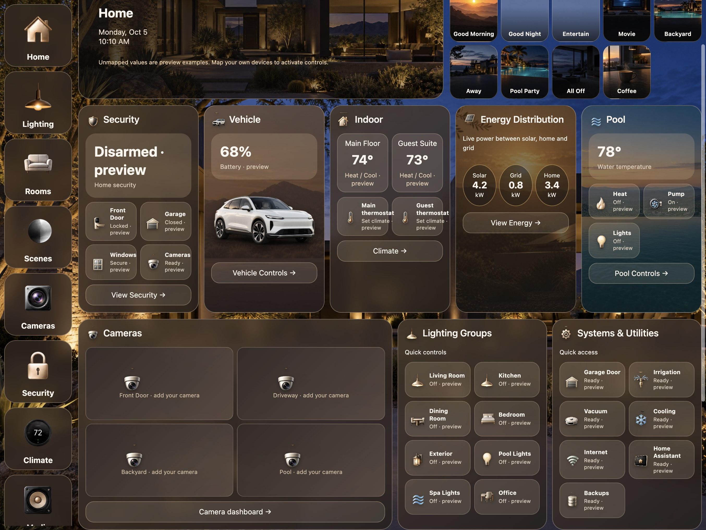
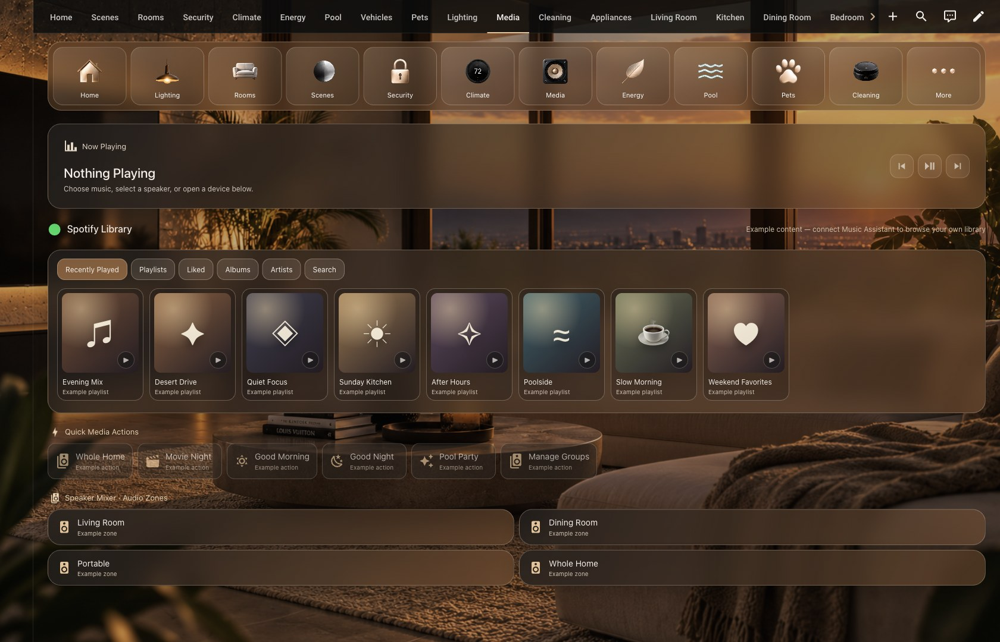

# My Home — Home Assistant dashboard starter

A configurable version of the owner's Home Assistant dashboard design. The **Home page keeps the original control-board structure**: illustrated navigation, weather and scenes, security, vehicle, two climate zones, energy distribution, pool, camera placeholders, lighting groups, utilities, and room shortcuts. The **Media page** keeps the library, Now Playing, playback controls, quick actions, and audio zones. Example values and artwork let people inspect the design before connecting devices.

The original private dashboard has 37 views. This package curates 22 views; the Home and Media pages have the detailed layouts, while the remaining pages are visual starting points. It does not include the owner's entity IDs, cameras, private device data, credentials, or conversation history.

## Preview

These screenshots show the **unmapped starter**, with example values. Controls become active only after the adopter maps their own devices.

| Home control board | Media library and Now Playing |
| --- | --- |
|  |  |

More previews: [Full Home page](screenshots/home-full.jpg) · [Symbol library](screenshots/symbol-library.jpg) · [Scenes](screenshots/scenes.jpg) · [Rooms](screenshots/rooms.jpg) · [Pool](screenshots/pool.jpg) · [Living Room](screenshots/living-room.jpg) · [Cleaning](screenshots/cleaning.jpg) · [Appliances](screenshots/appliances.jpg).

## What the Home tiles do

| Section | Example content | Behavior after mapping |
| --- | --- | --- |
| Weather | Current temperature and condition | Reads a weather entity; no device action. |
| Scenes | Nine illustrated scene buttons | Runs a mapped scene or script. |
| Security | Alarm, door, garage, windows, cameras | Shows live state; mapped small tiles open Home Assistant's detail dialog. There is no direct garage-opening button. |
| Vehicle | Battery and vehicle artwork | Shows live battery level; link opens Vehicles. |
| Indoor | Main and guest climate zones | Shows temperature and HVAC state; mapped thermostat tiles open HA climate controls. |
| Energy | Solar, grid, and home power | Shows mapped sensor values; link opens Energy. |
| Pool | Temperature, heat, pump, lights | Shows state; mapped tiles open HA's entity dialog. |
| Cameras | Four empty camera slots | Placeholders only; no camera streams are bundled. |
| Lighting Groups | Eight named light groups | Tapping a mapped light calls `light.toggle`. |
| Systems & Utilities | Garage, irrigation, vacuum, cooling, network, HA, backups | Opens the mapped entity dialog; no direct service action. |
| Rooms | Eight illustrated room shortcuts | Opens the corresponding starter room view. |

See [Home control mapping](docs/home-controls.md) for every key, expected entity type, and exact action. Missing mappings leave action buttons disabled and label sample values as previews.

## Contents and dependencies

- `dashboard.yaml` — generated 21-view Lovelace configuration with no live entity IDs.
- `mappings.example.json` and `scripts/build_dashboard.py` — starter configuration and generator.
- `components/` — bundled Lovelace cards for Home, Media, and illustrated navigation.
- `icons/` — reusable CSS, visual gallery, custom symbol index, and the built-in MDI names used by the original dashboard.
- `themes/vie_sauvage_luxury.yaml` — visual theme.
- `assets/` — approved backgrounds, nine scenes, eight fictional rooms, navigation and tile sprites, vehicle and appliance imagery.
- `screenshots/` — privacy-reviewed captures of the unmapped starter.

All 13 illustrated navigation symbols, eight tile sprite sheets, and nine appliance control SVGs found in the private dashboard are bundled. The Home and Media navigation bars use the original strip; the Home control board also uses selected illustrated tile symbols. The [symbol library](icons/README.md) exposes every sheet position as a reusable CSS class. Home Assistant Material Design Icons used elsewhere are listed by name. **The private dashboard's icon-to-entity CSS rules are not included** because they refer to the owner's devices. The example appliance gallery is visual until mapped.

This package requires Home Assistant with sections dashboards and custom card resources. [card-mod](https://github.com/thomasloven/lovelace-card-mod) supplies the glass styling on standard cards. Music Assistant is optional and needed for Media library lookup and library-item playback. Other custom cards used by the private dashboard are not required here.

## Install in a separate dashboard

1. Copy `assets/` to `/config/www/vie_sauvage_share/assets/`, `components/` to `/config/www/vie_sauvage_share/components/`, and `icons/` to `/config/www/vie_sauvage_share/icons/`. Their URLs begin with `/local/vie_sauvage_share/`.
2. Add the three `components/*.js` files as **JavaScript module** dashboard resources, using their `/local/vie_sauvage_share/components/` URLs. Reload the browser.
3. Copy `themes/vie_sauvage_luxury.yaml` to `/config/themes/`, reload themes, and select **Vie Sauvage Luxury**.
4. Install card-mod if you want the translucent card finish.
5. Create a **new** dashboard at URL path `vie-sauvage-starter`. Paste `dashboard.yaml` into its raw configuration editor. Keep your existing dashboard intact.
6. Copy `mappings.example.json` to `mappings.json`; fill in your own entity IDs and optional Media settings. Run `python3 scripts/build_dashboard.py --config mappings.json`, then paste the regenerated `dashboard.yaml` into the new dashboard.

`mappings.json` is excluded from Git because it may contain private entity IDs. `dashboard_path` must match the dashboard URL path. `entities_by_view` adds standard HA tile cards to feature and room pages; `home_entities` fills the Home board. The [control map](docs/home-controls.md) includes an example.

The Media board shows sample albums and playlists until a Music Assistant config entry ID is supplied. A mapped player enables Now Playing and previous/play-pause/next controls. Library lookup and item playback are implemented but have only been visually checked in preview mode; verify them with your Music Assistant version and player. Quick actions run only when explicitly configured.

## Privacy and distribution

The Home exterior and eight room scenes are fictional generated assets. The Rooms page Pool tile reuses the approved Pool page background. No live HA configuration, camera image, entity ID, token, address, or private dashboard screenshot is included. The repository is intended to be **private first** so the owner can inspect its contents and screenshots. Choose code and artwork licensing before making it public.

Run `python3 scripts/validate_package.py` after edits. It checks views, bundled references and components, screenshots, and known private markers. Review new assets and mappings yourself before sharing.
